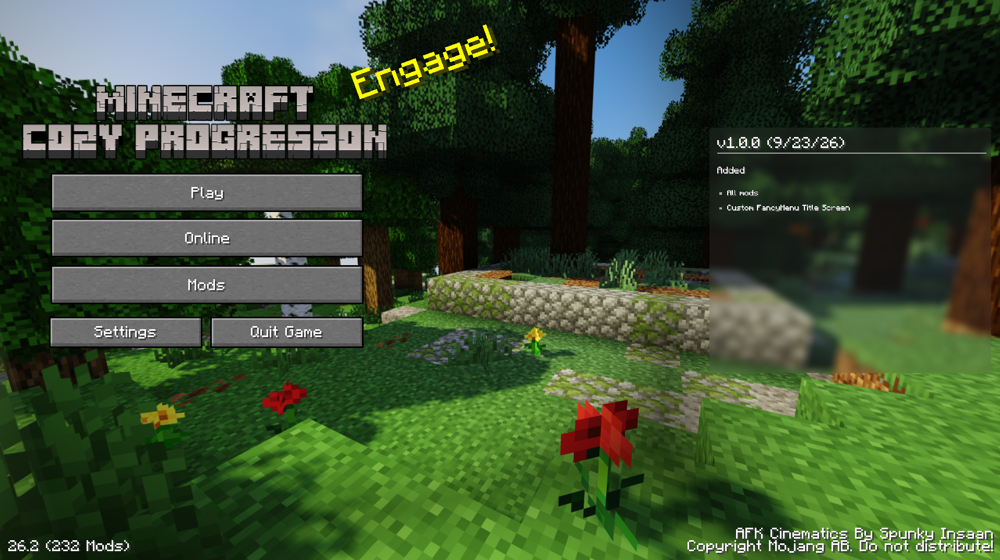

# Cozy Progression
Progression-based modpack with a hint of coziness while still keeping the minecraft feel!

Screenshots (custom title screen)

  
  

### Version & Loader
- Minecraft: 26.2
- Fabric
### About
This uses [Vanilla Progression](https://modrinth.com/mod/vanilla-progression-chaos-cubed-edition) to power the "Progression" part of it, along with a lineup of Macaw's building mods & Farmers Delight for the cozy side.
#### You may be asking, how does the progression work? Well:
You’ll advance through distinct ages by completing quests. Each age unlocks the next tier of tools and materials:
1. Wood Age (40 Quests) - Before stone tools
2. Stone Age (26 Quests)
3. Iron Age (30 Quests)
4. Diamond Age (24 Quests)
5. Nether Age (29 Quests)
6. End Age (22 Quests)
7. Post-End age (32 Quests)

### Pre-installed shaders:
- [LIGHT Shaders](https://modrinth.com/shader/light-shaders)
- [Solas Shader](https://modrinth.com/shader/solas-shader)
### Cozy Mods
- [Comforts](https://modrinth.com/mod/SaCpeal4)
- [Enchanted Vertical Slabs](https://modrinth.com/mod/TG1cHkRf)
- [Farmer's Delight](https://modrinth.com/mod/7vxePowz)
- [Macaw's Bridges](https://modrinth.com/mod/GURcjz8O)
- [Macaw's Doors](https://modrinth.com/mod/kNxa8z3e)
- [Macaw's Fences and Walls](https://modrinth.com/mod/GmwLse2I)
- [Macaw's Furniture](https://modrinth.com/mod/dtWC90iB)
- [Macaw's Paths and Pavings](https://modrinth.com/mod/VRLhWB91)
- [Macaw's Stairs and Balconies](https://modrinth.com/mod/iP3wH1ha)
- [Macaw's Windows](https://modrinth.com/mod/C7I0BCni)
- [Rustic Delight](https://modrinth.com/mod/foa4fGIH)

### Other (Progression / Adventure / Utility)
- [Backpacks!](https://modrinth.com/mod/MGcd6kTf)
- [Bartering Station](https://modrinth.com/mod/EOig9U0j)
- [Dungeons and Taverns](https://modrinth.com/mod/tpehi7ww)
- [Immersive Armors](https://modrinth.com/mod/eE2Db4YU)
- [Simple Copper Pipes](https://modrinth.com/mod/9r4ZkgSN)
- [Tectonic](https://modrinth.com/mod/lWDHr9jE)
- [Terralith](https://modrinth.com/mod/8oi3bsk5)
- [Towns and Towers](https://modrinth.com/mod/DjLobEOy)
- [Universal Graves](https://modrinth.com/mod/yn9u3ypm)
- [Vanilla Progression](https://modrinth.com/mod/vanilla-progression-chaos-cubed-edition)

Have a mod you'd like added? You can request it by opening an issue on this repository!
